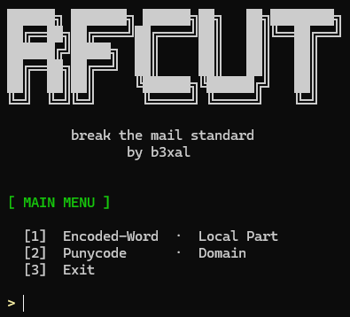
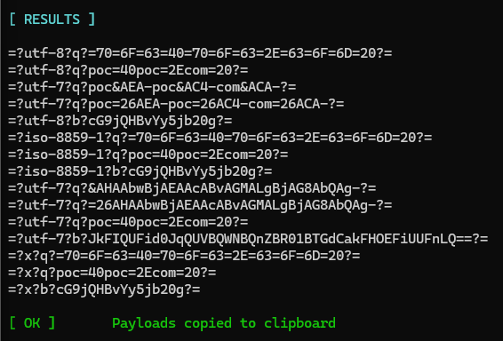
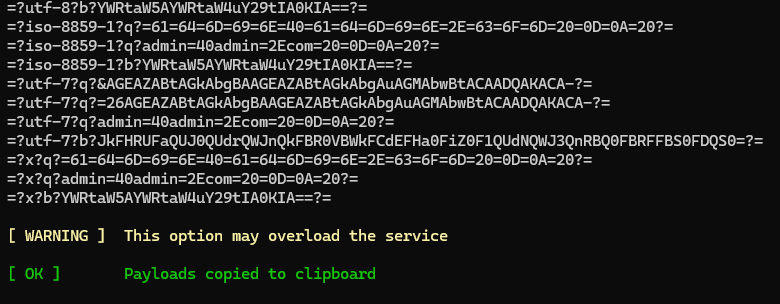
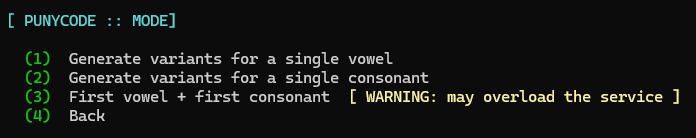
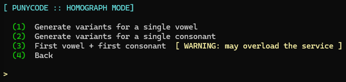
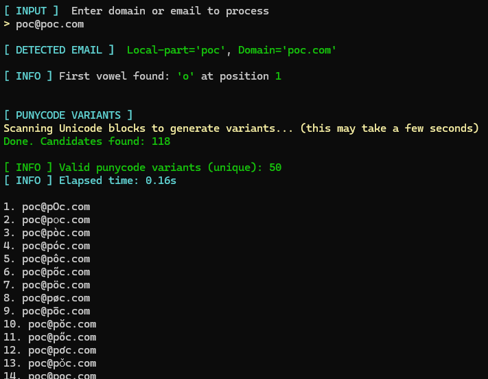
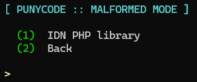
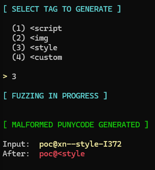

# RFCUT

This project is inspired by the outstanding research of **Gareth Heyes** ([“Splitting the Email Atom”](https://portswigger.net/research/splitting-the-email-atom#fuzzing-for-malformed-punycode)).
RFCUT builds upon his findings to explore real‑world email parsing discrepancies, from malformed local‑parts to broken Punycode domain handling, with the goal of improving security testing and defensive understanding.

**RFCUT** is an advanced offensive security tool designed to break, bypass and stress‑test email processing systems by generating malformed and ambiguous payloads based on RFC standards.
It focuses on exploiting discrepancies in **Encoded‑Word (RFC 2047)** handling and **Punycode / IDNA** domain normalization to uncover parsing bugs, filtering bypasses, and security weaknesses in mail servers, gateways and clients.

It is intended for **security research**, **penetration testing**, **CTFs**, and **email security assessments**.

If you want to **learn how to use RFCUT step by step** or **practice real‑world email security testing techniques**, follow the upcoming technical publication:

**→ In‑depth RFCUT Tutorial & Lab Walkthrough (Coming Soon)**

The article will guide you through practical attack scenarios, payload construction, and real parsing discrepancies observed in modern mail infrastructure.

RFCUT is built to encourage experimentation, curiosity and responsible security research.

---

## Features

### ✉️ Encoded-Word Payload Generator

- Full RFC 2047 exploitation engine  
- Generates ambiguous Encoded-Word payloads  
- Supports multiple charsets:
  - utf-8
  - iso-8859-1
  - utf-7
  - x (custom)
- Supports both encodings:
  - Q-encoding
  - Base64
- Partial encoding variants for:
  - Control characters
  - Punctuation injection
  - Special sequences (CRLF, CRLF+TAB, etc.)
- Automatic deduplication of results  
- **Fuzzer mode** for large-scale payload generation  
- Automatic clipboard export  

### 🌐 Punycode / Unicode Equivalence Engine

- Generates Unicode homoglyphs using ICU collation  
- Finds equivalent Unicode characters across blocks  
- Builds valid **Punycode domains**  
- Works with:
  - Domains  
  - Full email addresses  
- Detects local-part and domain automatically  
- Combined vowel + consonant mutation engine  
- Automatically tests and decodes working variants back to Unicode  

---

## Requirements

### Python

- Python 3.9+
- Python packages:
  - pyperclip
  - PyICU
``` 
pip3 install -r requirements.txt
```

### System Requirements

**Linux**
```
sudo apt install python3 python3-pip libicu-dev xclip
```
---

## Installation
```
git clone https://github.com/B3XAL/RFCUT.git  
cd RFCUT  
python3 -m venv rfcenv
source rfcenv/bin/activate
pip install -r requirements.txt 
sudo apt update
sudo apt install libicu-dev -y
composer require algo26-matthias/idna-convert:4.0.0 --ignore-platform-reqs
python3 RFCUT.py
```
---

## Example of Use

### Main Menu



### Encoded-Word Mode

Generate RFC 2047 payloads for bypass testing.


**Single Payload Mode**
- Build controlled malformed payloads  
- Inject punctuation  
- Inject control characters  
- Automatic RFC variations  



**Fuzzer Mode**
- Large-scale payload generation  
- Multi-variant injection engine  
- Automatic deduplication  
- Clipboard export  



---

### Punycode Mode

Generate Unicode / Punycode domain variants.

**Punycode Main**
- Homograph discovery
- Craft malformed Punycode



Features:
- Automatic email detection
- Unicode equivalence discovery
- IDNA punycode generation
- Combined vowel + consonant mutation
- Live decoding of successful variants
- Homograph discovery
- Malformed Punycode crafting

**Homograph Mode**
- Generate variants for a single vowel
- Generate variants for a single consonant
- First vowel + first consonant  *(may overload the service)*





**Malformed Punycode Mode**
- IDN PHP library testing




---

## Contributions

If you have improvements or new payload ideas, feel free to contribute.  
Open an **Issue** or submit a **Pull Request**.

---

## License

This project is released under the **MIT License**.  
See LICENSE for details.

---

*by b3xal*
